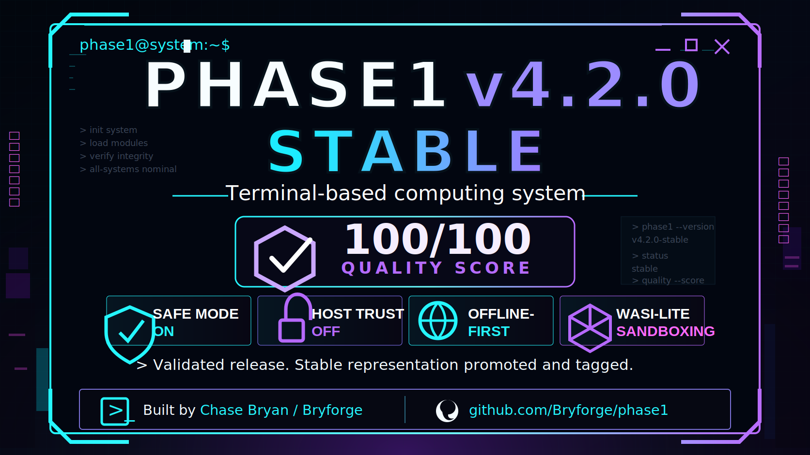

# Phase1

<p align="center">
  <a href="https://bryforge.github.io/phase1/">
    
  </a>
</p>

<p align="center">
  <strong>Terminal-first virtual OS / advanced operator console in Rust.</strong><br>
  Simulated kernel. VFS. Process table. Audit log. Guarded browser. Secure-by-default shell.
</p>

<p align="center">
  <a href="https://bryforge.github.io/phase1/"><strong>Open the Phase1 website</strong></a>
  ·
  <a href="WIKI_ROADMAP.md">Website + wiki roadmap</a>
  ·
  <a href="base1/README.md">Base1 secure host foundation</a>
  ·
  <a href="QUALITY.md">Quality system</a>
  ·
  <a href="RELEASE_v4.1.0.md">v4.1.0 release prep</a>
  ·
  <a href="EDGE.md">Bleeding edge</a>
</p>

     

Phase1 is a Rust-built, terminal-first educational virtual operating-system console. It models boot profiles, a virtual kernel, a VFS, process scheduling, `/proc`, `/dev`, `/var/log`, guarded networking, command capability metadata, pipelines, update tooling, runtime management, a guarded terminal browser, and a Base1 secure-host foundation.

Base1 is the planned secure hardware host foundation for Phase1 on Raspberry Pi and ThinkPad X200-class systems. Its mission is to keep the host bootable, recoverable, and protected if Phase1 is damaged, corrupted, or reset.

## Release tracks

`prepare-v4.1.0-stable` prepares the stable `v4.1.0` release candidate. After validation, create `release/v4.1.0` and tag `v4.1.0` from the validated commit.

`release/v4.0.0` preserves the previous stable `v4.0.0` release point.

`edge/v4.2.0-dev` is the next bleeding-edge development branch after `v4.1.0`. It intentionally carries a `-dev` package version and may contain work that is not yet release-qualified.

## Website

The main Phase1 homepage is designed for GitHub Pages:

```text
https://bryforge.github.io/phase1/
```

It uses a dark live-space background, moving rainbow visuals, the Phase1 neon logo, an interactive browser terminal demo, sponsor/founder sections, and a website/wiki implementation roadmap. Desktop browsing performance is protected with reduced canvas detail on large screens, debounced resize handling, hidden-tab animation pause, and reduced-motion support.

## Status

| Track | Version | Notes |
| --- | --- | --- |
| Stable | `v4.1.0` | Current stable release candidate prepared for tag `v4.1.0` |
| Previous stable | `v4.0.0` | Previous stable release line |
| Edge | `v4.2.0-dev` | Bleeding-edge branch for development beyond v4.1.0 |
| Compatibility base | `v3.6.0` | Historical comparison base |
| Base1 | `foundation` | Secure host design for Raspberry Pi and X200 targets |
| Quality | `managed` | Scorecard, gates, scripts, and CI workflow |

The package version is the booted Phase1 version. Boot, ready line, `/proc/version`, dashboard, audit boot record, `/home/readme.txt`, and shutdown dynamically reflect `CARGO_PKG_VERSION`.

## Quick start

```bash
git clone https://github.com/Bryforge/phase1.git
cd phase1
cargo run
```

For stable validation:

```bash
git checkout prepare-v4.1.0-stable
sh scripts/quality-check.sh full
```

For bleeding-edge work:

```bash
git checkout edge/v4.2.0-dev
cargo run
```

Inside Phase1:

```text
help
cat readme.txt
wiki
wiki-quick
version --compare
security
sysinfo
roadmap
```

## Quality management

Phase1 includes a repeatable quality management system with policy, scorecard, validation scripts, CI checks, and tests.

Start here:

- [`QUALITY.md`](QUALITY.md) - quality policy, gates, score model, and ownership areas.
- [`QUALITY_SCORECARD.md`](QUALITY_SCORECARD.md) - score interpretation and scoring areas.
- [`scripts/quality-score.sh`](scripts/quality-score.sh) - deterministic repository health score.
- [`scripts/quality-check.sh`](scripts/quality-check.sh) - quick/full quality gates.

Run:

```bash
sh scripts/quality-score.sh
sh scripts/quality-check.sh quick
```

Before release:

```bash
sh scripts/quality-check.sh full
```

## Base1 secure host foundation

Base1 is designed as the real-hardware host layer below Phase1. It treats Phase1 as a contained workload and keeps host boot files, host packages, host secrets, recovery paths, and security policy outside Phase1 control.

Start here:

- [`base1/README.md`](base1/README.md) - Base1 overview.
- [`base1/SECURITY_MODEL.md`](base1/SECURITY_MODEL.md) - threat model and security architecture.
- [`base1/HARDWARE_TARGETS.md`](base1/HARDWARE_TARGETS.md) - Raspberry Pi and X200 target matrix.
- [`base1/PHASE1_COMPATIBILITY.md`](base1/PHASE1_COMPATIBILITY.md) - Base1 and Phase1 compatibility contract.
- [`base1/ROADMAP.md`](base1/ROADMAP.md) - staged Base1 roadmap.

First safe checks:

```bash
sh scripts/base1-preflight.sh
```

The preflight checker is read-only. It reports readiness and warnings without changing the host.

## In-system wiki

Phase1 includes sandboxed WASI-lite manual pages readable from the prompt:

```text
wiki
wiki-quick
wiki-version
wiki-boot
wiki-commands
wiki-files
wiki-browse
wiki-lang
wiki-updates
wiki-trouble
wiki-tutorials
```

## Editors

`ned` is the quick line editor. It supports saving without quitting:

```text
ned notes.txt
:w      save
:wq     save and quit
.       save and quit
:q      quit without saving
```

`avim` is the advanced VFS editor:

```text
avim hello.py
```

Use `:help` inside `avim` for movement, edit, search, save, and quit commands.

## Post-v4.1 edge focus

- Keep `v4.1.0` preserved on `release/v4.1.0` after validation.
- Advance `edge/v4.2.0-dev` with guarded experimental work.
- Continue improving editor usability, terminal wrapping, website responsiveness, Base1 compatibility, and supply-chain hardening.
- Integrate approved post-stable work only after quality and security review.
- Keep release-facing documentation explicit about stable versus edge status.

## Run checks

Install local security tools once:

```bash
cargo install cargo-audit --locked
cargo install cargo-deny --locked
```

Then run the full quality gate:

```bash
sh scripts/quality-check.sh full
```

The Rust-specific gate remains:

```bash
cargo fmt --all -- --check
cargo check --all-targets
cargo clippy --all-targets -- -D warnings
cargo test --all-targets
cargo audit
cargo deny check
```

`cargo test --all-targets` includes unit tests plus scripted smoke tests for the main Phase1 shell, the guarded `phase1-storage` helper, the website, release metadata, quality system files, and the Base1 secure host foundation files.

CI runs Rust validation, security validation, CodeQL, and the quality management workflow on pull requests and branch pushes.

## Enable Python, browser, network inspection, and runtimes

```bash
chmod +x scripts/phase1-runtimes.sh
./scripts/phase1-runtimes.sh
```

Manual boot equivalent:

```text
4    SHIELD off
t    TRUST HOST on
1    BOOT
```

## Manual and tutorials

The full manual lives in `docs/wiki/` and can be published to GitHub Wiki with:

```bash
chmod +x scripts/publish-wiki.sh
./scripts/publish-wiki.sh
```

The public website/wiki roadmap lives in [`WIKI_ROADMAP.md`](WIKI_ROADMAP.md).

## Safety

Phase1 is an educational simulator. It should never need your GitHub password, personal access token, SSH private key, browser cookies, Apple ID, email password, or recovery codes.

Host-backed commands are explicit and guarded. Runtime files such as `phase1.state`, `phase1.history`, and `phase1.log` are local operational artifacts. Command history and ops logs are sanitized before storage.

Base1 is a secure host foundation, not a destructive installer. Its first tooling is intentionally read-only and compatibility-focused. Base1 security claims should remain conservative until backed by repeatable builds, audits, and hardware validation.

## License

GPL-3.0
