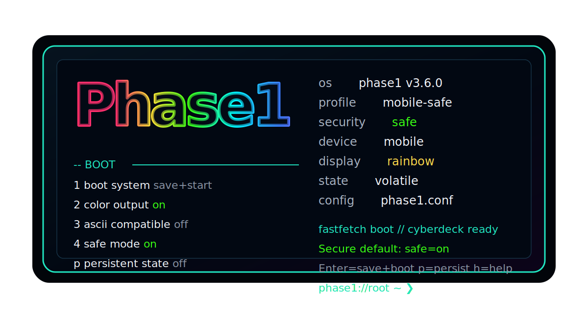

# phase1

<p align="center">
  
</p>

<p align="center">
  <strong>Terminal-first virtual OS console in Rust.</strong><br>
  Simulated kernel. VFS. Process table. Audit log. Secure-by-default operator shell.
</p>

**phase1** is a terminal-first educational virtual operating-system console written in Rust.

It runs as a safe userspace simulator while modeling real OS concepts: a VFS with optional `/home` persistence, simulated process scheduler, syscall-style shell operations, `/proc`, `/dev`, `/var/log`, PCIe enumeration, guarded network views, guarded host tools, plugins, generated man pages, command completion metadata, compact dashboard telemetry, and an in-memory audit log.

Current release: **v3.6.0**

## Highlights

- Secure-by-default boot profile: safe mode is enabled unless intentionally disabled.
- Mobile-friendly advanced operator console UI with automatic mobile-profile detection.
- Retro fastfetch-style preboot selector with colored `phase1` ASCII art.
- Configurable boot options for color, ASCII compatibility, safe mode, quick boot, mobile mode, persistent state, reboot, and quit.
- Optional persistent state mode saves and restores `/home` VFS content through `phase1.state`.
- Safe mode blocks host execution, host network inspection, browser fetches, ping, WiFi scan/connect, Python, C compiler, and plugins.
- In safe mode, network display is limited to a simulated loopback interface.
- Enhanced `matrix` / `rain` digital-rain terminal effect with clean `q` exit, forever mode, themes, density, tail, and speed controls.
- Compact `dash --compact` dashboard for release/demo screenshots.
- Registry-backed `help`, `man`, `complete`, aliases, and capability metadata.
- `security` / `sec` / `policy` command for safe-mode, host-tool, persistence, and privacy status.
- `capabilities` / `caps` command for command guard and policy visibility.
- `accounts` / `users` command for simulated Unix account layout without real emails or credentials.
- Syscall-style kernel boundary for read, write, spawn, and kill paths.
- In-memory audit log exposed through `audit`.
- Browser allows only `http://` and `https://` and strips HTML into terminal text when host mode is intentionally enabled.
- VFS includes `/home`, `/proc`, `/dev`, `/tmp`, `/var/log`, `/etc`, and `/bin`.
- CI checks formatting, compilation, Clippy, tests, cargo-audit, and cargo-deny.

## Quick start

Secure default:

```bash
cargo run
```

or

```bash
cargo build --release
./target/release/phase1
```

Trusted host-backed testing mode, only when intentional:

```bash
PHASE1_SAFE_MODE=0 PHASE1_ALLOW_HOST_TOOLS=1 cargo run
```

Host network changes require an additional explicit opt-in:

```bash
PHASE1_SAFE_MODE=0 PHASE1_ALLOW_HOST_TOOLS=1 PHASE1_ALLOW_HOST_NETWORK_CHANGES=1 cargo run
```

## Preboot configuration

On launch, phase1 opens a fastfetch-inspired boot selector before entering the shell. Press Enter to boot immediately, or toggle options by number/name:

```text
1 / boot        enter the main system
2 / color       toggle retro rainbow ANSI color
3 / ascii       toggle ASCII-compatible display mode
4 / safe        toggle safe mode; default is on
5 / quick       skip the full boot matrix after selecting options
6 / mobile      force mobile-friendly layout defaults
p / persistent  toggle persistent state before entering the system
7 / reboot      restart the boot selector without entering the shell
8 / quit        abort boot and exit before the main system starts
9 / save        save the active boot profile to phase1.conf
0 / reset       reload secure default boot settings and remove saved boot config
```

Safe mode is on by default. Turning safe mode off is not enough to run host-backed tools by itself. Trusted host-backed commands require both safe mode off and `PHASE1_ALLOW_HOST_TOOLS=1`.

When persistent state is on, phase1 loads `/home` content from `phase1.state` before the shell starts and saves `/home` changes back to `phase1.state` after shell commands. This keeps user-created VFS files available across runs while leaving system paths such as `/proc`, `/dev`, and `/var/log` freshly simulated each boot. Do not store secrets in persistent state.

The selector automatically enables mobile mode for narrow terminals and common mobile terminal environments. It also honors environment defaults:

```bash
PHASE1_ASCII=1 cargo run
PHASE1_NO_COLOR=1 cargo run
PHASE1_SAFE_MODE=1 cargo run
PHASE1_SAFE_MODE=0 cargo run   # safe mode off, host tools still blocked without PHASE1_ALLOW_HOST_TOOLS=1
PHASE1_SAFE_MODE=0 PHASE1_ALLOW_HOST_TOOLS=1 cargo run
PHASE1_QUICK_BOOT=1 cargo run
PHASE1_MOBILE_MODE=1 cargo run
PHASE1_PERSISTENT_STATE=1 cargo run
PHASE1_DEVICE=mobile cargo run
```

## Useful commands

```text
help
commands
complete p
security
accounts
capabilities
bootcfg
bootcfg show
bootcfg state
dash --compact
matrix 0
matrix --help
matrix 20 --speed 25 --density 40 --chars hex
rain 5
man matrix
man browser
ls -l /
cat /proc/version
spawn worker --background
jobs
ps
audit
echo "hello world" > note.txt
cat note.txt
browser phase1
browser https://example.com
```

## Matrix controls

`matrix` now exits cleanly without Ctrl+C in an interactive terminal.

```text
matrix 10                              run for 10 seconds
matrix 0                               run until q
matrix forever                         run until q
matrix --help                          show all options
matrix 20 --speed 25 --density 40      faster and denser rain
matrix 0 --chars symbols --tail 24     longer operator-style streams
matrix 15 --mono --no-hud              plain terminal mode
```

Press `q` to return to the phase1 shell.

## Safety model

phase1 simulates the kernel, VFS, process table, and scheduler in memory. Optional persistent state only writes phase1-managed `/home` VFS content to the local `phase1.state` file. Runtime state files and common credential files are ignored by Git.

Safe mode is the default and blocks host-backed command paths. When safe mode is disabled, host-backed command paths still require `PHASE1_ALLOW_HOST_TOOLS=1`. Some commands can call host tools (`python3`, `cc`/`gcc`/`clang`, `curl`, `ping`, `nmcli`, `networksetup`) only after that explicit opt-in. Those paths use validation and timeouts. `wifi-connect` is dry-run by default and requires `PHASE1_ALLOW_HOST_NETWORK_CHANGES=1` before it attempts host network mutation.

phase1 should never need your GitHub password, personal access token, SSH private key, browser cookies, Apple ID, email password, or recovery codes. The repository examples and simulated account model do not include real emails, passwords, tokens, or account secrets. See `SECURITY.md` and `SECURITY_REVIEW.md` before publishing releases or sharing runtime files.

## Roadmap designs

The roadmap design index is in `ROADMAP_DESIGNS.md`.

Detailed design tracks:

- `docs/roadmap/operator-shell.md`
- `docs/roadmap/virtual-kernel.md`
- `docs/roadmap/security-capabilities.md`
- `docs/roadmap/structured-pipelines.md`
- `docs/roadmap/package-plugin-runtime.md`
- `docs/roadmap/tui-dashboard.md`

## Release notes

Current release notes are in `RELEASE_NOTES_v3.6.0.md`.

## Development checks

```bash
cargo fmt --all -- --check
cargo check --all-targets
cargo clippy --all-targets -- -D warnings
cargo test --all-targets
cargo audit
cargo deny check
```

For the end-to-end command smoke suite:

```bash
cargo test --test smoke -- --nocapture
```

## Roadmap

- Persistent shell history.
- Structured command output and pipelines.
- Capability enforcement based on command metadata.
- WASM/WASI plugin runtime.
- Full-screen TUI dashboard.
