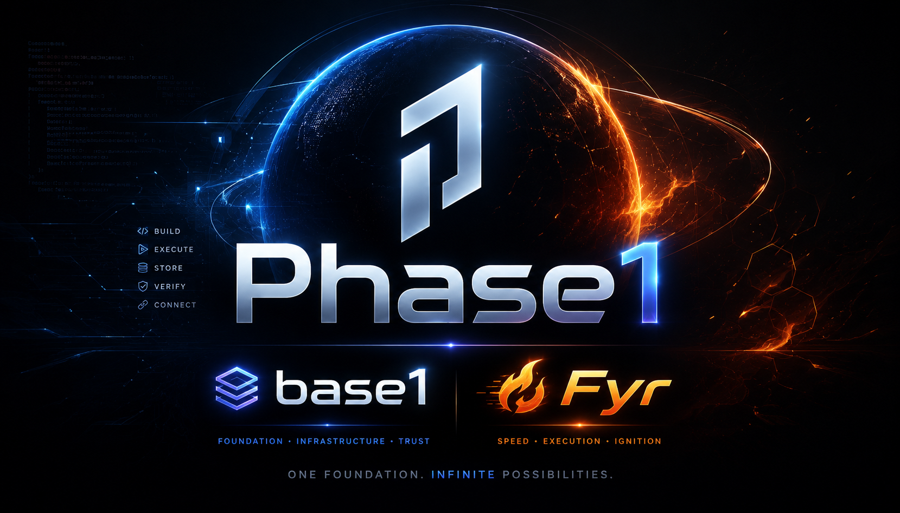

# Phase1

> [Live project status](https://bryforge.github.io/phase1/status.html) · [status.json](https://bryforge.github.io/phase1/status.json) · current roadmap estimate: **66%**

<p align="center">
  <a href="https://bryforge.github.io/phase1/">
    
  </a>
</p>

<p align="center">
  <strong>secure · private · powerful · open</strong><br>
  Terminal-first Rust virtual OS console for operators, builders, and learners who want control.
</p>

<p align="center">
  <a href="https://bryforge.github.io/phase1/"><strong>Website</strong></a>
  ·
  <a href="#quick-start"><strong>Quick start</strong></a>
  ·
  <a href="docs/project/FEATURE_STATUS.md">Feature status</a>
  ·
  <a href="docs/REPOSITORY_NAVIGATION.md">Repository guide</a>
  ·
  <a href="docs/REORGANIZATION_PLAN.md">Reorganization</a>
  ·
  <a href="docs/project/PHASE1_NATIVE_LANGUAGE.md">Fyr language</a>
  ·
  <a href="docs/quality/QUALITY.md">Quality</a>
  ·
  <a href="CONTRIBUTING.md">Contributing</a>
  ·
  <a href="base1/README.md">Base1</a>
  ·
  <a href="docs/repo/EDGE.md">Edge</a>
</p>

<p align="center">
  
  
  
  
  
  
  
  
</p>

## What is Phase1?

Phase1 is a Rust-built, terminal-first virtual operating-system console created by Chase Bryan / Bryforge. It gives a futuristic operator surface backed by practical systems ideas: a simulated kernel, virtual filesystem, process table, audit log, command metadata, guarded host access, storage helpers, local learning, the Fyr native language, Nested Phase1 metadata-control, and a long-term operating-system track through Base1.

Phase1 is not yet a kernel, hardened sandbox, or drop-in replacement for Linux, macOS, or Windows. The OS track is a staged plan to make Phase1 the primary user environment on bootable hardware through a minimal Base1 foundation, recovery path, installer, hardware matrix, x86_64 boot-support planning, and conservative security claims.

## Current edge highlights

| Area | Current surface |
| --- | --- |
| Operator console | Boot selector, dashboards, shell commands, help/man pages, autocomplete, mobile-safe UI, and theme controls. |
| Virtual OS model | Simulated kernel, VFS, process table, `/proc`, `/dev`, `/var/log`, architecture reports, and system inspection commands. |
| Guarded host access | Safe mode on by default, explicit trust gates, command capability metadata, and secret redaction. |
| Fyr native language | `.fyr` scripts with prints, returns, let bindings, arithmetic, assertions, comparisons, boolean chains, grouped expressions, `if` return statements, test runner, package checks, syntax color output, and Fyr-aware tab completion for actions and demo files. |
| Nested Phase1 | Metadata-only recursive operator contexts with `nest status`, `nest spawn`, `nest enter`, `nest destroy`, `nest inspect`, and `nest tree`. |
| Base1 OS track | Long-term path toward a bootable Phase1-first system with Base1 as the trusted host layer, recovery, installer, update, storage, x86_64 boot profiles, and hardware validation. |
| Learning system | `phase1-learn` stores local sanitized memory, imports history, learns notes/rules, and suggests next actions. |
| Storage and runtimes | Guarded storage/Git helper, Rust workflows, and a roadmap for broader programming-language support. |
| Security and crypto docs | Crypto policy roadmap, provider registry, config schema, profile docs, non-claims, and integrity gates. |
| Quality system | Scorecards, smoke tests, release metadata checks, CI workflows, CodeQL, and repeatable validation scripts. |

## Quick start

Fresh clone, simplest launch:

```bash
git clone https://github.com/Bryforge/phase1.git
cd phase1
sh phase1
```

After the file is executable, you can also run:

```bash
./phase1
```

Install a local `phase1` terminal command on macOS/Linux:

```bash
sh scripts/install-phase1-command.sh
phase1
```

Useful startup checks:

```bash
sh phase1 version
sh phase1 doctor
sh phase1 selftest
```

Rust-native launch remains available:

```bash
cargo run
```

Inside Phase1, start with:

```text
help
capabilities
sysinfo
security
nest status
nest tree
wiki-quick
version --compare
roadmap
```

## Repository navigation and support

The repository now has a clearer navigation layer for users, contributors, support, quality, and reorganization work.

Start here:

- [`docs/REPOSITORY_NAVIGATION.md`](docs/REPOSITORY_NAVIGATION.md) — fast paths, repository map, reader paths, issue-template chooser, quality-gate chooser, and reorganization rules.
- [`docs/REORGANIZATION_PLAN.md`](docs/REORGANIZATION_PLAN.md) — minimalist target structure, destination map, move policy, compatibility rules, and rollback rules.
- [`docs/README.md`](docs/README.md) — documentation index.
- [`CONTRIBUTING.md`](CONTRIBUTING.md) — repository-wide contribution guidelines.
- [`.github/pull_request_template.md`](.github/pull_request_template.md) — PR template.

Issue templates:

- [`.github/ISSUE_TEMPLATE/bug_report.yml`](.github/ISSUE_TEMPLATE/bug_report.yml) — reproducible defects.
- [`.github/ISSUE_TEMPLATE/support_request.yml`](.github/ISSUE_TEMPLATE/support_request.yml) — help using Phase1, Base1, Fyr, or docs.
- [`.github/ISSUE_TEMPLATE/feature_request.yml`](.github/ISSUE_TEMPLATE/feature_request.yml) — proposed improvements.
- [`.github/ISSUE_TEMPLATE/documentation_issue.yml`](.github/ISSUE_TEMPLATE/documentation_issue.yml) — missing, outdated, confusing, or unsafe docs.

Organized destination indexes:

- [`docs/releases/README.md`](docs/releases/README.md) — release/checkpoint documentation destination.
- [`docs/website/README.md`](docs/website/README.md) — website, branding, accessibility, and public-content planning.
- [`examples/README.md`](examples/README.md) — safe examples, Fyr scripts, walkthroughs, and dry-run demo material.
- [`tools/README.md`](tools/README.md) — internal maintainer utilities and future automation helpers.

## Implementation status

Phase1 separates implemented features from experimental host integrations and future plans. The canonical matrix is [`docs/project/FEATURE_STATUS.md`](docs/project/FEATURE_STATUS.md).

| Feature area | Status | Short answer |
| --- | --- | --- |
| Terminal shell, VFS, process table, audit log, `/proc`, text tools, and dashboards | Implemented | Simulated Phase1 subsystems covered by tests and smoke checks. |
| Fyr native language | Implemented and growing | Current edge supports a practical seed language surface and package test flow. |
| Nested Phase1 metadata contexts | Implemented checkpoint | Metadata-only context controls are present; runtime-backed child kernels are future work. |
| Local learning memory | Implemented | Local, sanitized, bounded, and git-ignored. |
| WASI-lite plugins | Implemented | Phase1's sandboxed plugin path; no host shell/network passthrough. |
| Python/Git/Cargo/Rust host-backed workflows | Experimental | Useful local integrations, but not hardened secure execution. |
| Host network/admin mutation | Restricted | Requires explicit trust gates and safe-mode changes. |
| Hardened VM/chroot/container sandbox | Not planned | Use a real VM/container for hostile code. |
| Base1 boot readiness | B2 initial script present | Current readiness is tracked in [`docs/os/BOOT_READINESS_STATUS.md`](docs/os/BOOT_READINESS_STATUS.md); next target is B3 VM boot validation after B2 review/status links are complete. |
| Base1 x86_64 boot support | B2 dry-run assembly preview | B1 detection uses `scripts/base1-x86_64-detect.sh --dry-run`; B2 assembly preview uses `scripts/base1-b2-assembly-dry-run.sh --dry-run --profile x86_64-vm-validation`. Both are bounded by limitations and validation docs. |
| Phase1 OS track | Long-term roadmap | Base1-backed path toward a bootable Phase1-first environment; not a current drop-in OS replacement. |

Inside Phase1, run `capabilities` to inspect command-level gates and guard status.

## Nested Phase1 checkpoint

Nested Phase1 is the first recursive operator-environment checkpoint for Phase1. It introduces safe metadata-only child contexts before any real inner-kernel execution exists.

Current nested commands:

```text
nest status
nest spawn <name>
nest list
nest enter <name>
nest exit
nest destroy <name>
nest rm <name>
nest inspect <name>
nest info <name>
nest tree
```

The current surface is intentionally conservative: it tracks child contexts, active context, depth, paths, and topology while preserving the existing Phase1 host boundary. Start with [`docs/nest/CHECKPOINT.md`](docs/nest/CHECKPOINT.md).

## Phase1 operating-system track

Phase1 now has an explicit long-term operating-system track. The immediate goal is not to claim a finished OS. The goal is to move toward a bootable, recoverable, Phase1-first environment through Base1.

Start with [`docs/os/ROADMAP.md`](docs/os/ROADMAP.md). The first Stage 1 design slice is [`docs/os/BASE1_IMAGE_BUILDER.md`](docs/os/BASE1_IMAGE_BUILDER.md). The installer/recovery slice is [`docs/os/INSTALLER_RECOVERY.md`](docs/os/INSTALLER_RECOVERY.md).

The staged path is:

1. Documentation pivot and guardrails.
2. Base1 bootable foundation.
3. Installer and recovery.
4. Daily-driver basics.
5. Phase1-owned system surface.
6. Hardware target validation.
7. Automatic x86_64 detection and boot-parameter support planning.
8. Hardened-by-design posture where implementation, validation, recovery, and review evidence support the claim.

Current guardrail: Phase1 remains a virtual OS console until boot images, recovery, update paths, hardware support, and audits exist.

Boot readiness status is tracked in [`docs/os/BOOT_READINESS_STATUS.md`](docs/os/BOOT_READINESS_STATUS.md). The boot-readiness race plan lives at [`docs/os/BOOT_READINESS_RACE_PLAN.md`](docs/os/BOOT_READINESS_RACE_PLAN.md). x86_64 boot planning starts at [`docs/os/X86_64_BOOT_SUPPORT_ROADMAP.md`](docs/os/X86_64_BOOT_SUPPORT_ROADMAP.md).

B6 X200 marker checkpoint: [`docs/checkpoints/B6_X200_MARKER_CHECKPOINT.md`](docs/checkpoints/B6_X200_MARKER_CHECKPOINT.md). This records `phase1_marker_seen` evidence on the named X200 path and preserves the non-claims: no installer, recovery-complete, hardening, release-candidate, or daily-driver readiness claim.

B1 documents:

- [`docs/os/B1_READ_ONLY_DETECTION_PLAN.md`](docs/os/B1_READ_ONLY_DETECTION_PLAN.md)
- [`docs/os/B1_READ_ONLY_DETECTION_LIMITATIONS.md`](docs/os/B1_READ_ONLY_DETECTION_LIMITATIONS.md)
- [`docs/os/B1_READ_ONLY_DETECTION_VALIDATION.md`](docs/os/B1_READ_ONLY_DETECTION_VALIDATION.md)

B2 documents:

- [`docs/os/B2_DRY_RUN_ASSEMBLY_PLAN.md`](docs/os/B2_DRY_RUN_ASSEMBLY_PLAN.md)
- [`docs/os/B2_DRY_RUN_ASSEMBLY_LIMITATIONS.md`](docs/os/B2_DRY_RUN_ASSEMBLY_LIMITATIONS.md)
- [`docs/os/B2_DRY_RUN_ASSEMBLY_VALIDATION.md`](docs/os/B2_DRY_RUN_ASSEMBLY_VALIDATION.md)

Run the B1 detector:

```bash
sh scripts/base1-x86_64-detect.sh --dry-run
```

Run the B2 dry-run assembly preview:

```bash
sh scripts/base1-b2-assembly-dry-run.sh --dry-run --profile x86_64-vm-validation
```

Run the B1/B2 tests:

```bash
cargo test -p phase1 --test base1_x86_64_detect_script
cargo test -p phase1 --test b1_read_only_detection_limitations_docs
cargo test -p phase1 --test b1_read_only_detection_validation_docs
cargo test -p phase1 --test b2_dry_run_assembly_plan_docs
cargo test -p phase1 --test base1_b2_assembly_dry_run_script
cargo test -p phase1 --test b2_dry_run_assembly_limitations_docs
cargo test -p phase1 --test b2_dry_run_assembly_validation_docs
```

## Fyr native language

Fyr is the Phase1-native language target for VFS automation, self-construction, and operator-owned scripts. It is designed around C-style explicit control, a Rust-style safety posture, and Python-style readability while staying owned by Phase1.

Current Fyr visual assets:

- Symbol: [`assets/fyr_symbol.png`](assets/fyr_symbol.png)
- Word mark: [`assets/fyr_word.png`](assets/fyr_word.png)

Start with [`docs/project/PHASE1_NATIVE_LANGUAGE.md`](docs/project/PHASE1_NATIVE_LANGUAGE.md), then follow the dedicated [`Fyr roadmap`](docs/fyr/ROADMAP.md).

First working script inside Phase1. With raw line editing enabled, `fy<Tab>`, `fyr ru<Tab>`, and `fyr run hello_<Tab>` complete to the Fyr command, run action, and demo file path:

```text
echo 'fn main() -> i32 { print("Hello, hacker!"); return 0; }' > hello_hacker.fyr
fyr run hello_hacker.fyr
```

Expected output:

```text
Hello, hacker!
```

## Public assets and branding

Current verified public asset paths:

| Asset | Path |
| --- | --- |
| Public Phase1/Base1/Fyr banner | [`assets/phase1_base_fyr_banner1.png`](assets/phase1_base_fyr_banner1.png) |
| Phase1 word mark PNG | [`assets/phase1_word.png`](assets/phase1_word.png) |
| Fyr symbol | [`assets/fyr_symbol.png`](assets/fyr_symbol.png) |
| Fyr word mark | [`assets/fyr_word.png`](assets/fyr_word.png) |

Branding and website organization policy lives in [`docs/website/README.md`](docs/website/README.md). Older references to `assets/fyr-flame.svg` should be treated as outdated because the Fyr visual mark now uses the uploaded PNG assets above.

## Release tracks

| Track | Version | Purpose |
| --- | --- | --- |
| Stable | `v6.0.0` | Current stable line for release-qualified work. |
| Previous stable | `v5.0.0` | Preserved previous stable release point. |
| Edge | `v7.0.1` | Experimental development branch beyond stable. |
| Compatibility base | `v3.6.0` | Historical comparison base for compatibility references. |
| Base1 | `foundation` | Secure host design for real hardware targets and the long-term Phase1 OS track. |

Use stable release tags or release branches when you want the safest repository state. Use edge branches only for active development and experimental polish.

## Smart local learning

Phase1 includes a local-first learning companion:

```bash
cargo run --bin phase1-learn -- status
cargo run --bin phase1-learn -- import-history
cargo run --bin phase1-learn -- suggest
```

Teach it project knowledge:

```bash
cargo run --bin phase1-learn -- teach deploy = use main for GitHub Pages deploys
cargo run --bin phase1-learn -- ask deploy
```

The learning memory is local, sanitized, bounded, and ignored by git. It does not call a cloud model or upload data. See [`docs/project/LEARNING.md`](docs/project/LEARNING.md).

## Public website

The public face of Phase1 lives at:

```text
https://bryforge.github.io/phase1/
```

The site presents the project as a polished neon/cyber operator system: animated space visuals, Phase1 branding, browser terminal demo, founder profile, sponsor path, wiki links, and mobile-first public documentation.

Website planning and public-content organization live in [`docs/website/README.md`](docs/website/README.md).

## Project structure

```text
.github/              GitHub issue templates, PR template, workflows, and automation
assets/               Public images, logos, icons, banners, and branding files
base1/                Base1 compatibility entry points and root-level Base1 docs
docs/                 Repository-first manual, navigation, roadmaps, support docs, and security docs
docs/releases/        Organized release and checkpoint documentation
docs/website/         Website, branding, accessibility, and public content planning
examples/             Safe examples, walkthrough inputs, Fyr scripts, and dry-run demo material
scripts/              Quality, runtime, Base1, wiki, and learning helpers
tests/                Rust tests and documentation guard tests
tools/                Internal maintainer utilities and future automation helpers
src/                  Phase1 shell, kernel model, commands, UI, browser, runtime surfaces
src/bin/              Helper binaries including phase1-storage, phase1-install, phase1-learn
phase1-core/          Core package workspace member
xtask/                Repository validation helper
```

## Quality and validation

Run the quick repository gate:

```bash
sh scripts/quality-check.sh quick
```

Run the full validation gate before release work:

```bash
sh scripts/quality-check.sh full
```

Focused gates:

```bash
sh scripts/quality-check.sh base1-docs
sh scripts/quality-check.sh base1-reorg
sh scripts/quality-check.sh security-crypto-docs
```

Rust-specific validation:

```bash
cargo fmt --all -- --check
cargo check --all-targets
cargo clippy --all-targets -- -D warnings
cargo test --all-targets
```

Optional security tooling:

```bash
cargo install cargo-audit --locked
cargo install cargo-deny --locked
cargo audit
cargo deny check
```

CI validates formatting, workspace checks, tests, quality rules, security workflow posture, and release metadata on pull requests and protected branch pushes.

## Base1 secure host foundation

Base1 is the planned real-hardware host layer below Phase1. Its purpose is to keep the host bootable, recoverable, and protected while Phase1 runs as a contained workload. Base1 is also the foundation for the long-term Phase1 operating-system track.

Start here:

- [`docs/os/ROADMAP.md`](docs/os/ROADMAP.md) — Phase1 operating-system track
- [`docs/os/BOOT_READINESS_STATUS.md`](docs/os/BOOT_READINESS_STATUS.md) — current boot-readiness tracker and B1/B2 gate
- [`docs/checkpoints/B6_X200_MARKER_CHECKPOINT.md`](docs/checkpoints/B6_X200_MARKER_CHECKPOINT.md) — B6 X200 marker checkpoint and non-claim evidence anchor.
- [`docs/os/BOOT_READINESS_RACE_PLAN.md`](docs/os/BOOT_READINESS_RACE_PLAN.md) — fast, evidence-bound path toward boot readiness
- [`docs/os/B1_READ_ONLY_DETECTION_PLAN.md`](docs/os/B1_READ_ONLY_DETECTION_PLAN.md) — B1 read-only detection plan
- [`docs/os/B1_READ_ONLY_DETECTION_LIMITATIONS.md`](docs/os/B1_READ_ONLY_DETECTION_LIMITATIONS.md) — B1 detector limitations and non-claims
- [`docs/os/B1_READ_ONLY_DETECTION_VALIDATION.md`](docs/os/B1_READ_ONLY_DETECTION_VALIDATION.md) — B1 detector validation expectations
- [`docs/os/B2_DRY_RUN_ASSEMBLY_PLAN.md`](docs/os/B2_DRY_RUN_ASSEMBLY_PLAN.md) — B2 dry-run assembly plan
- [`docs/os/B2_DRY_RUN_ASSEMBLY_LIMITATIONS.md`](docs/os/B2_DRY_RUN_ASSEMBLY_LIMITATIONS.md) — B2 dry-run assembly limitations and non-claims
- [`docs/os/B2_DRY_RUN_ASSEMBLY_VALIDATION.md`](docs/os/B2_DRY_RUN_ASSEMBLY_VALIDATION.md) — B2 dry-run assembly validation expectations
- [`docs/os/X86_64_BOOT_SUPPORT_ROADMAP.md`](docs/os/X86_64_BOOT_SUPPORT_ROADMAP.md) — x86_64 boot support and boot-parameter roadmap
- [`docs/os/BASE1_IMAGE_BUILDER.md`](docs/os/BASE1_IMAGE_BUILDER.md) — Base1 image-builder design
- [`docs/os/INSTALLER_RECOVERY.md`](docs/os/INSTALLER_RECOVERY.md) — Base1 installer and recovery design
- [`docs/os/BASE1_INSTALLER_DRY_RUN.md`](docs/os/BASE1_INSTALLER_DRY_RUN.md) — Base1 installer dry-run design.
- [`docs/os/BASE1_RECOVERY_COMMAND.md`](docs/os/BASE1_RECOVERY_COMMAND.md) — Base1 recovery command design.
- [`docs/os/BASE1_ROLLBACK_METADATA.md`](docs/os/BASE1_ROLLBACK_METADATA.md) — Base1 rollback metadata design.
- [`base1/RECOVERY_USB_DESIGN.md`](base1/RECOVERY_USB_DESIGN.md) — Recovery USB design.
- [`base1/RECOVERY_USB_COMMAND_INDEX.md`](base1/RECOVERY_USB_COMMAND_INDEX.md) — Recovery USB command index.
- [`base1/RECOVERY_USB_TARGET_COMMAND_INDEX.md`](base1/RECOVERY_USB_TARGET_COMMAND_INDEX.md) — Recovery USB target command index.
- [`base1/RECOVERY_USB_TARGET_SELECTION.md`](base1/RECOVERY_USB_TARGET_SELECTION.md) — Recovery USB target selection design.
- [`docs/base1/releases/RELEASE_BASE1_RECOVERY_USB_TARGET_READONLY_V1.md`](docs/base1/releases/RELEASE_BASE1_RECOVERY_USB_TARGET_READONLY_V1.md) — Recovery USB target read-only checkpoint release notes.
- [`base1/RECOVERY_USB_IMAGE_COMMAND_INDEX.md`](base1/RECOVERY_USB_IMAGE_COMMAND_INDEX.md) — Recovery USB image command index.
- [`base1/RECOVERY_USB_IMAGE_PROVENANCE.md`](base1/RECOVERY_USB_IMAGE_PROVENANCE.md) — Recovery USB image provenance.
- [`base1/RECOVERY_USB_IMAGE_SUMMARY.md`](base1/RECOVERY_USB_IMAGE_SUMMARY.md) — Recovery USB image summary.
- [`docs/base1/releases/RELEASE_BASE1_RECOVERY_USB_IMAGE_READONLY_V1.md`](docs/base1/releases/RELEASE_BASE1_RECOVERY_USB_IMAGE_READONLY_V1.md) — Recovery USB image read-only checkpoint release notes.
- [`base1/RECOVERY_USB_EMERGENCY_SHELL.md`](base1/RECOVERY_USB_EMERGENCY_SHELL.md) — Recovery USB emergency shell design.
- [`base1/RECOVERY_USB_EMERGENCY_SHELL_COMMAND_INDEX.md`](base1/RECOVERY_USB_EMERGENCY_SHELL_COMMAND_INDEX.md) — Recovery USB emergency shell command index.
- [`docs/base1/releases/RELEASE_BASE1_RECOVERY_USB_EMERGENCY_SHELL_READONLY_V1.md`](docs/base1/releases/RELEASE_BASE1_RECOVERY_USB_EMERGENCY_SHELL_READONLY_V1.md) — Recovery USB emergency shell read-only checkpoint release notes.
- [`base1/RECOVERY_USB_EMERGENCY_SHELL_SUMMARY.md`](base1/RECOVERY_USB_EMERGENCY_SHELL_SUMMARY.md) — Recovery USB emergency shell summary.
- [`base1/RECOVERY_USB_HARDWARE_CHECKLIST.md`](base1/RECOVERY_USB_HARDWARE_CHECKLIST.md) — Recovery USB hardware checklist.
- [`base1/RECOVERY_USB_HARDWARE_SUMMARY.md`](base1/RECOVERY_USB_HARDWARE_SUMMARY.md) — Recovery USB hardware summary.
- [`docs/base1/releases/RELEASE_BASE1_RECOVERY_USB_HARDWARE_READONLY_V1.md`](docs/base1/releases/RELEASE_BASE1_RECOVERY_USB_HARDWARE_READONLY_V1.md) — Recovery USB hardware read-only checkpoint release notes.
- [`docs/os/BASE1_DRY_RUN_COMMANDS.md`](docs/os/BASE1_DRY_RUN_COMMANDS.md) — Base1 dry-run command index
- [`base1/README.md`](base1/README.md) — Base1 overview
- [`base1/SECURITY_MODEL.md`](base1/SECURITY_MODEL.md) — security model and boundary
- [`base1/HARDWARE_TARGETS.md`](base1/HARDWARE_TARGETS.md) — Raspberry Pi, X200, and generic target matrix
- [`base1/LIBREBOOT_PROFILE.md`](base1/LIBREBOOT_PROFILE.md) — Libreboot profile for X200-class operator laptops
- [`base1/LIBREBOOT_COMMAND_INDEX.md`](base1/LIBREBOOT_COMMAND_INDEX.md) — Libreboot command index.
- [`base1/LIBREBOOT_DOCS_SUMMARY.md`](base1/LIBREBOOT_DOCS_SUMMARY.md) — Libreboot docs summary.
- [`base1/LIBREBOOT_GRUB_RECOVERY.md`](base1/LIBREBOOT_GRUB_RECOVERY.md) — Libreboot GRUB recovery notes.
- [`base1/LIBREBOOT_MILESTONE.md`](base1/LIBREBOOT_MILESTONE.md) — Libreboot milestone checkpoint.
- [`base1/LIBREBOOT_OPERATOR_CHECKLIST.md`](base1/LIBREBOOT_OPERATOR_CHECKLIST.md) — Libreboot operator checklist.
- [`base1/LIBREBOOT_PREFLIGHT.md`](base1/LIBREBOOT_PREFLIGHT.md) — Libreboot preflight notes.
- [`base1/LIBREBOOT_QUICKSTART.md`](base1/LIBREBOOT_QUICKSTART.md) — Libreboot quickstart.
- [`base1/LIBREBOOT_VALIDATION_REPORT.md`](base1/LIBREBOOT_VALIDATION_REPORT.md) — Libreboot validation report.
- [`docs/base1/releases/RELEASE_BASE1_LIBREBOOT_READONLY_V1.md`](docs/base1/releases/RELEASE_BASE1_LIBREBOOT_READONLY_V1.md) — Libreboot read-only checkpoint v1 release notes.
- [`docs/base1/releases/RELEASE_BASE1_LIBREBOOT_READONLY_V1_1.md`](docs/base1/releases/RELEASE_BASE1_LIBREBOOT_READONLY_V1_1.md) — Libreboot read-only checkpoint v1.1 release notes.
- [`docs/base1/releases/RELEASE_BASE1_B6_X200_MARKER_CHECKPOINT_V1.md`](docs/base1/releases/RELEASE_BASE1_B6_X200_MARKER_CHECKPOINT_V1.md) — B6 X200 marker checkpoint v1 release note.

First safe checks are read-only or dry-run oriented:

```bash
sh scripts/base1-x86_64-detect.sh --dry-run
sh scripts/base1-b2-assembly-dry-run.sh --dry-run --profile x86_64-vm-validation
sh scripts/base1-preflight.sh
sh scripts/base1-libreboot-preflight.sh
sh scripts/base1-install-dry-run.sh --dry-run --target /dev/example
sh scripts/base1-recovery-dry-run.sh --dry-run
sh scripts/base1-storage-layout-dry-run.sh --dry-run --target /dev/example
sh scripts/base1-rollback-metadata-dry-run.sh --dry-run
```

The preflight, detector, assembly preview, and dry-run checkers should report no writes.

## Runtime and host-backed features

Phase1 defaults to a guarded posture. Some host-backed features require explicit trust and safe-mode changes.

```bash
chmod +x scripts/phase1-runtimes.sh
./scripts/phase1-runtimes.sh
```

Manual boot equivalent:

```text
4    SHIELD off
t    TRUST HOST on
1    BOOT
```

Do this only when you understand the host boundary.

## Safety model

Phase1 should never need your GitHub password, personal access token, SSH private key, browser cookies, Apple ID, email password, recovery codes, or private credentials.

Host-backed commands are explicit and guarded. Runtime files such as `phase1.state`, `phase1.history`, `phase1.learn`, and `phase1.log` are local operational artifacts. Command history, learning memory, and ops logs are sanitized before storage.

Security claims stay conservative until they are backed by repeatable builds, tests, audits, boot-image validation, recovery validation, and hardware validation. Hardening is a roadmap goal, but current hardened-status claims require implementation, tests, validation reports, recovery evidence, and review evidence.

## Contributing

Read [`CONTRIBUTING.md`](CONTRIBUTING.md) before opening work. Phase1 values useful engineering over hype. Good contributions improve clarity, safety, documentation, validation, mobile fit, terminal usability, runtime support, Base1 compatibility, Fyr language work, crypto policy, x86_64 boot planning, or the staged OS track.

Pull requests should use the repository template in [`.github/pull_request_template.md`](.github/pull_request_template.md) and explain validation, risk, safe-default impact, and compatibility impact.

Before opening release-facing work, run:

```bash
cargo fmt --all -- --check
cargo check --all-targets
cargo test --all-targets
sh scripts/quality-check.sh quick
```

For focused documentation or safety-sensitive work, also run the relevant gate:

```bash
sh scripts/quality-check.sh base1-docs
sh scripts/quality-check.sh security-crypto-docs
```

## License

Phase1 is released under GPL-3.0-only.

<!-- phase1:auto:repo-model:start -->
## Phase1 repository model

- `base/v6.0.0` is the current stable base.
- `edge/stable` is the active default development path.
- `checkpoint/*` branches are verified milestone snapshots.
- `feature/*` branches target `edge/stable`.

Keep stable bases boring. Move tested work through edge/stable.
<!-- phase1:auto:repo-model:end -->

<!-- phase1:auto:current-status:start -->
## Current development status

- Current edge version: `v7.0.1`
- Stable base: `base/v6.0.0`
- Active path: `edge/stable`
- Docs are generated by `scripts/update-docs.py`.
<!-- phase1:auto:current-status:end -->

## Modern help

Phase1 v6 exposes a topic-aware help deck:

    help
    help --compact
    help host
    help sys
    help update
    help <command>
    complete <prefix>

The boot LIVE OPS panel now points operators toward the compact help map, category help, dashboard, security status, ops log, theme list, tips, and update protocol.

### Help command palette

The modern help surface includes a visual command palette and workflow deck:

    help ui
    help flows
    help --compact
    help <category>
    help <command>

Use `help ui` for a launch-pad view and `help flows` for daily check, safe update, development, recovery planning, and discovery workflows.

### v6 visual default

The v6 edge console defaults to the `crimson` palette when no `PHASE1_THEME` override is set. The legacy bleeding-edge palette remains available manually with `theme edge`.

## Documentation

- [The Phase1 Codex](docs/MANUAL_ROADMAP.md)
- [Documentation index](docs/README.md)
- [Repository navigation](docs/REPOSITORY_NAVIGATION.md)
- [Repository reorganization plan](docs/REORGANIZATION_PLAN.md)

## Fyr native language

Fyr is the Phase1 native language track.

- Visual symbol: [`assets/fyr_symbol.png`](assets/fyr_symbol.png)
- Word mark: [`assets/fyr_word.png`](assets/fyr_word.png)
- Language spec: [`docs/project/PHASE1_NATIVE_LANGUAGE.md`](docs/project/PHASE1_NATIVE_LANGUAGE.md)
- Roadmap: [`docs/fyr/ROADMAP.md`](docs/fyr/ROADMAP.md)
- Quick run: `fyr run hello_hacker.fyr`

## Additional Base1 public surfaces

- [`base1/NETWORK_LOCKDOWN_DRY_RUN.md`](base1/NETWORK_LOCKDOWN_DRY_RUN.md) — Base1 network lockdown dry-run.
- [`base1/PHASE1_COMPATIBILITY.md`](base1/PHASE1_COMPATIBILITY.md) — Phase1 compatibility contract.
- [`base1/ROADMAP.md`](base1/ROADMAP.md) — Base1 roadmap.
- [`base1/RECOVERY_USB_TARGET_SUMMARY.md`](base1/RECOVERY_USB_TARGET_SUMMARY.md) — Recovery USB target summary.
- [`base1/RECOVERY_USB_VALIDATION_REPORT.md`](base1/RECOVERY_USB_VALIDATION_REPORT.md) — Recovery USB validation report.
- [`docs/os/B4_RECOVERY_EVIDENCE.md`](docs/os/B4_RECOVERY_EVIDENCE.md) — B4 recovery evidence.
- [`docs/os/B4_RECOVERY_VALIDATION.md`](docs/os/B4_RECOVERY_VALIDATION.md) — B4 recovery validation.
- [`docs/os/BASE1_DUAL_PATH_DELIVERY.md`](docs/os/BASE1_DUAL_PATH_DELIVERY.md) — Base1 dual-path delivery.
- [`docs/os/BASE1_STORAGE_LAYOUT_CHECKER.md`](docs/os/BASE1_STORAGE_LAYOUT_CHECKER.md) — Base1 storage layout checker design.
- [`docs/os/BASE1_SUPERVISOR_ARTIFACT_FLOW.md`](docs/os/BASE1_SUPERVISOR_ARTIFACT_FLOW.md) — Base1 supervisor artifact flow.
- [`docs/os/BASE1_SUPERVISOR_CONTROL_PLANE.md`](docs/os/BASE1_SUPERVISOR_CONTROL_PLANE.md) — Base1 supervisor control plane.
- [`docs/os/BASE1_SUPERVISOR_ORCHESTRATION.md`](docs/os/BASE1_SUPERVISOR_ORCHESTRATION.md) — Base1 supervisor orchestration.
- [`docs/os/BASE1_SUPERVISOR_POLICY_BUS.md`](docs/os/BASE1_SUPERVISOR_POLICY_BUS.md) — Base1 supervisor policy bus.
- [`docs/os/BASE1_SUPERVISOR_PROFILES.md`](docs/os/BASE1_SUPERVISOR_PROFILES.md) — Base1 supervisor profiles.
- [`docs/os/BASE1_SUPERVISOR_STORAGE_TIER.md`](docs/os/BASE1_SUPERVISOR_STORAGE_TIER.md) — Base1 supervisor storage tier.

## Security and crypto policy

- [`SECURITY.md`](SECURITY.md) — Security reporting, safe defaults, host trust gates, and vulnerability-handling guidance.
- [`docs/security/README.md`](docs/security/README.md) — Security documentation index.
- [`docs/security/TRUST_MODEL.md`](docs/security/TRUST_MODEL.md) — Trust model, safe defaults, and security/usability principle.
- [`docs/security/CRYPTO_POLICY_ROADMAP.md`](docs/security/CRYPTO_POLICY_ROADMAP.md) — Crypto policy roadmap and evidence-bound crypto goals.

Phase1 treats security and usability as a shared goal: safe defaults should be understandable, reviewable, and hard to bypass accidentally.
Crypto policy remains documentation-first until implementation, tests, provider review, and validation evidence exist.

Security and crypto usability rule:

- Crypto policy documents approved cryptographic profiles by control point before any profile is connected to real protection decisions.
- Phase1 keeps security usable: normal users keep safe defaults, while advanced operators can review explicit trust gates and evidence-backed policy docs.

## Historical archive

Older planning notes, development checkpoints, AI/Gina notes, AVIM notes, and legacy next-update files have been moved out of the repository root and preserved under [`docs/archive/README.md`](docs/archive/README.md).

Use the current root entry points first: `README.md`, `docs/project/FEATURE_STATUS.md`, `docs/quality/QUALITY.md`, `docs/repo/EDGE.md`, `docs/repo/REPO_CHANNELS.md`, and `docs/REPOSITORY_NAVIGATION.md`.
