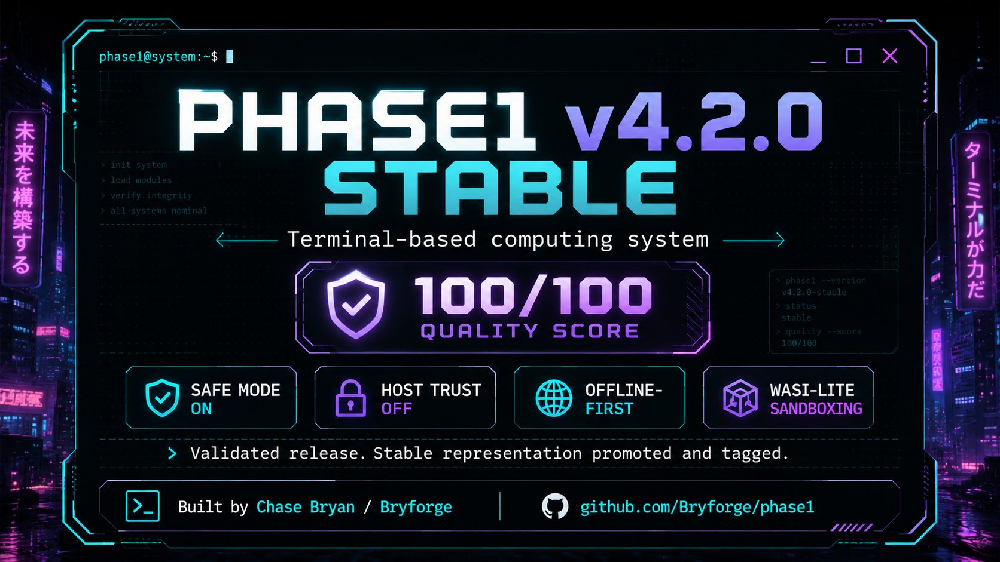

# Phase1

<p align="center">
  <a href="https://bryforge.github.io/phase1/">
    
  </a>
</p>

<p align="center">
  <strong>secure · private · powerful · open</strong><br>
  Terminal-first Rust virtual OS console for operators, builders, and learners who want control.
</p>

<p align="center">
  <a href="https://bryforge.github.io/phase1/"><strong>Website</strong></a>
  ·
  <a href="#quick-start"><strong>Quick start</strong></a>
  ·
  <a href="FEATURE_STATUS.md">Feature status</a>
  ·
  <a href="docs/nest/CHECKPOINT.md">Nested Phase1</a>
  ·
  <a href="docs/os/ROADMAP.md">OS track</a>
  ·
  <a href="docs/os/BASE1_IMAGE_BUILDER.md">Base1 image-builder design</a>
  ·
  <a href="PHASE1_NATIVE_LANGUAGE.md">Fyr language</a>
  ·
  <a href="LEARNING.md">Learning</a>
  ·
  <a href="QUALITY.md">Quality</a>
  ·
  <a href="base1/README.md">Base1</a>
  ·
  <a href="EDGE.md">Edge</a>
</p>

<p align="center">
  
  
  
  
  
  
  
</p>

## What is Phase1?

Phase1 is a Rust-built, terminal-first virtual operating-system console created by Chase Bryan / Bryforge. It gives a futuristic operator surface backed by practical systems ideas: a simulated kernel, virtual filesystem, process table, audit log, command metadata, guarded host access, storage helpers, local learning, the Fyr native language, Nested Phase1 metadata-control, and a long-term operating-system track through Base1.

Phase1 is not yet a kernel, hardened sandbox, or drop-in replacement for Linux, macOS, or Windows. The OS track is a staged plan to make Phase1 the primary user environment on bootable hardware through a minimal Base1 foundation, recovery path, installer, hardware matrix, and conservative security claims.

## Current edge highlights

| Area | Current surface |
| --- | --- |
| Operator console | Boot selector, dashboards, shell commands, help/man pages, autocomplete, mobile-safe UI, and theme controls. |
| Virtual OS model | Simulated kernel, VFS, process table, `/proc`, `/dev`, `/var/log`, architecture reports, and system inspection commands. |
| Guarded host access | Safe mode on by default, explicit trust gates, command capability metadata, and secret redaction. |
| Fyr native language | `.fyr` scripts with prints, returns, let bindings, arithmetic, assertions, comparisons, boolean chains, grouped expressions, `if` return statements, test runner, package checks, and syntax color output. |
| Nested Phase1 | Metadata-only recursive operator contexts with `nest status`, `nest spawn`, `nest enter`, `nest destroy`, `nest inspect`, and `nest tree`. |
| Base1 OS track | Long-term path toward a bootable Phase1-first system with Base1 as the trusted host layer, recovery, installer, update, storage, network, and hardware validation. |
| Learning system | `phase1-learn` stores local sanitized memory, imports history, learns notes/rules, and suggests next actions. |
| Storage and runtimes | Guarded storage/Git helper, Rust workflows, and a roadmap for broader programming-language support. |
| Base1 foundation | Planned secure host layer for Raspberry Pi and ThinkPad X200-class systems. |
| Quality system | Scorecards, smoke tests, release metadata checks, CI workflows, CodeQL, and repeatable validation scripts. |

## Nested Phase1 checkpoint

Nested Phase1 is the first recursive operator-environment checkpoint for Phase1. It introduces safe metadata-only child contexts before any real inner-kernel execution exists.

Current nested commands:

```text
nest status
nest spawn <name>
nest list
nest enter <name>
nest exit
nest destroy <name>
nest rm <name>
nest inspect <name>
nest info <name>
nest tree
```

The current surface is intentionally conservative: it tracks child contexts, active context, depth, paths, and topology while preserving the existing Phase1 host boundary. Start with [`docs/nest/CHECKPOINT.md`](docs/nest/CHECKPOINT.md).

## Phase1 operating-system track

Phase1 now has an explicit long-term operating-system track. The immediate goal is not to claim a finished OS. The goal is to move toward a bootable, recoverable, Phase1-first environment through Base1.

Start with [`docs/os/ROADMAP.md`](docs/os/ROADMAP.md). The first Stage 1 design slice is [`docs/os/BASE1_IMAGE_BUILDER.md`](docs/os/BASE1_IMAGE_BUILDER.md). The installer/recovery slice is [`docs/os/INSTALLER_RECOVERY.md`](docs/os/INSTALLER_RECOVERY.md).

The staged path is:

1. Documentation pivot and guardrails.
2. Base1 bootable foundation.
3. Installer and recovery.
4. Daily-driver basics.
5. Phase1-owned system surface.
6. Hardware target validation.

Current guardrail: Phase1 remains a virtual OS console until boot images, recovery, update paths, hardware support, and audits exist.

## Fyr native language

Fyr is the Phase1-native language target for VFS automation, self-construction, and operator-owned scripts. It is designed around C-style explicit control, a Rust-style safety posture, and Python-style readability while staying owned by Phase1.

Start with [`PHASE1_NATIVE_LANGUAGE.md`](PHASE1_NATIVE_LANGUAGE.md), then follow the dedicated [`Fyr roadmap`](docs/fyr/ROADMAP.md).

First working script inside Phase1:

```text
echo 'fn main() -> i32 { print("Hello, hacker!"); return 0; }' > hello_hacker.fyr
fyr run hello_hacker.fyr
```

Expected output:

```text
Hello, hacker!
```

## Quick start

Fresh clone, simplest launch:

```bash
git clone https://github.com/Bryforge/phase1.git
cd phase1
sh phase1
```

After the file is executable, you can also run:

```bash
./phase1
```

Install a local `phase1` terminal command on macOS/Linux:

```bash
sh scripts/install-phase1-command.sh
phase1
```

Useful startup checks:

```bash
sh phase1 version
sh phase1 doctor
sh phase1 selftest
```

Rust-native launch remains available:

```bash
cargo run
```

Inside Phase1, start with:

```text
help
capabilities
sysinfo
security
nest status
nest tree
wiki-quick
version --compare
roadmap
```

## Implementation status

Phase1 separates implemented features from experimental host integrations and future plans. The canonical matrix is [`FEATURE_STATUS.md`](FEATURE_STATUS.md).

| Feature area | Status | Short answer |
| --- | --- | --- |
| Terminal shell, VFS, process table, audit log, `/proc`, text tools, and dashboards | Implemented | Simulated Phase1 subsystems covered by tests and smoke checks. |
| Fyr native language | Implemented and growing | Current edge supports a practical seed language surface and package test flow. |
| Nested Phase1 metadata contexts | Implemented checkpoint | Metadata-only context controls are present; runtime-backed child kernels are future work. |
| Local learning memory | Implemented | Local, sanitized, bounded, and git-ignored. |
| WASI-lite plugins | Implemented | Phase1's sandboxed plugin path; no host shell/network passthrough. |
| Python/Git/Cargo/Rust host-backed workflows | Experimental | Useful local integrations, but not hardened secure execution. |
| Host network/admin mutation | Restricted | Requires explicit trust gates and safe-mode changes. |
| Hardened VM/chroot/container sandbox | Not planned | Use a real VM/container for hostile code. |
| Phase1 OS track | Long-term roadmap | Base1-backed path toward a bootable Phase1-first environment; not a current drop-in OS replacement. |

Inside Phase1, run `capabilities` to inspect command-level gates and guard status.

## Latest version check

Stable is currently `v5.0.0`. The next development package line is `v5.1.0`.

To update your local checkout and see the active package version:

```bash
git fetch origin
git pull --ff-only origin master
sh phase1 version
```

Use stable release tags or release branches when you want the safest repository state. Use `v5.0.0` for the stable public representation. Use `v5.1.0` only for future development and experimental polish.

## Smart local learning

Phase1 includes a local-first learning companion:

```bash
cargo run --bin phase1-learn -- status
cargo run --bin phase1-learn -- import-history
cargo run --bin phase1-learn -- suggest
```

Teach it project knowledge:

```bash
cargo run --bin phase1-learn -- teach deploy = use main for GitHub Pages deploys
cargo run --bin phase1-learn -- ask deploy
```

The learning memory is local, sanitized, bounded, and ignored by git. It does not call a cloud model or upload data. See [`LEARNING.md`](LEARNING.md).

## Release tracks

| Track | Version | Purpose |
| --- | --- | --- |
| Stable | `v5.0.0` | Current stable line for release-qualified work. |
| Previous stable | `v4.4.0` | Preserved previous stable release point. |
| Edge | `v5.1.0` | Experimental development branch beyond stable. |
| Compatibility base | `v3.6.0` | Historical comparison base for compatibility references. |
| Base1 | `foundation` | Secure host design for real hardware targets and the long-term Phase1 OS track. |

Use stable release tags or release branches when you want the safest repository state. Use edge branches only for active development and experimental polish.

## Public website

The public face of Phase1 lives at:

```text
https://bryforge.github.io/phase1/
```

The site presents the project as a polished neon/cyber operator system: animated space visuals, Phase1 branding, browser terminal demo, founder profile, sponsor path, wiki links, and mobile-first public documentation.

## Project structure

```text
src/                  Phase1 shell, kernel model, commands, UI, browser, runtime surfaces
src/bin/              Helper binaries including phase1-storage, phase1-install, phase1-learn
phase1-core/          Core package workspace member
xtask/                Repository validation helper
base1/                Secure host foundation docs and scripts
docs/nest/            Nested Phase1 checkpoint documentation
docs/os/              Phase1 operating-system track and Base1 image-builder roadmap
docs/wiki/            Manual and tutorial source
scripts/              Quality, runtime, Base1, wiki, and learning helpers
.github/workflows/    CI, CodeQL, Pages, and quality automation
```

## Quality and validation

Run the quick repository gate:

```bash
sh scripts/quality-check.sh quick
```

Run the full validation gate before release work:

```bash
sh scripts/quality-check.sh full
```

Rust-specific validation:

```bash
cargo fmt --all -- --check
cargo check --all-targets
cargo clippy --all-targets -- -D warnings
cargo test --all-targets
```

Nested Phase1 checkpoint validation:

```bash
cargo test -p phase1 --test nest_status
cargo test -p phase1 --test nest_spawn
cargo test -p phase1 --test nest_enter
cargo test -p phase1 --test nest_destroy
cargo test -p phase1 --test nest_inspect
cargo test -p phase1 --test nest_tree
```

OS-track documentation validation:

```bash
cargo test -p phase1 --test os_replacement_track_docs
cargo test -p phase1 --test base1_image_builder_docs
```

Optional security tooling:

```bash
cargo install cargo-audit --locked
cargo install cargo-deny --locked
cargo audit
cargo deny check
```

CI validates formatting, workspace checks, tests, quality rules, security workflow posture, and release metadata on pull requests and protected branch pushes.

## Base1 secure host foundation

Base1 is the planned real-hardware host layer below Phase1. Its purpose is to keep the host bootable, recoverable, and protected while Phase1 runs as a contained workload. Base1 is also the foundation for the long-term Phase1 operating-system track.

Start here:

- [`docs/os/ROADMAP.md`](docs/os/ROADMAP.md) — Phase1 operating-system track
- [`docs/os/BASE1_IMAGE_BUILDER.md`](docs/os/BASE1_IMAGE_BUILDER.md) — Base1 image-builder design
- [`docs/os/INSTALLER_RECOVERY.md`](docs/os/INSTALLER_RECOVERY.md) — Base1 installer and recovery design
- [`docs/os/BASE1_INSTALLER_DRY_RUN.md`](docs/os/BASE1_INSTALLER_DRY_RUN.md) — Base1 installer dry-run design
- [`docs/os/BASE1_RECOVERY_COMMAND.md`](docs/os/BASE1_RECOVERY_COMMAND.md) — Base1 recovery command design
- [`docs/os/BASE1_STORAGE_LAYOUT_CHECKER.md`](docs/os/BASE1_STORAGE_LAYOUT_CHECKER.md) — Base1 storage layout checker design
- [`docs/os/BASE1_ROLLBACK_METADATA.md`](docs/os/BASE1_ROLLBACK_METADATA.md) — Base1 rollback metadata design
- [`docs/os/BASE1_DRY_RUN_COMMANDS.md`](docs/os/BASE1_DRY_RUN_COMMANDS.md) — Base1 dry-run command index
- [`base1/README.md`](base1/README.md) — Base1 overview
- [`base1/SECURITY_MODEL.md`](base1/SECURITY_MODEL.md) — security model and boundary
- [`base1/HARDWARE_TARGETS.md`](base1/HARDWARE_TARGETS.md) — Raspberry Pi and X200 target matrix
- [`base1/LIBREBOOT_PROFILE.md`](base1/LIBREBOOT_PROFILE.md) — Libreboot profile for X200-class operator laptops
- [`base1/LIBREBOOT_PREFLIGHT.md`](base1/LIBREBOOT_PREFLIGHT.md) — Libreboot preflight notes for GRUB-first systems
- [`base1/LIBREBOOT_GRUB_RECOVERY.md`](base1/LIBREBOOT_GRUB_RECOVERY.md) — Libreboot GRUB recovery notes
- [`base1/LIBREBOOT_OPERATOR_CHECKLIST.md`](base1/LIBREBOOT_OPERATOR_CHECKLIST.md) — Libreboot operator checklist
- [`base1/LIBREBOOT_MILESTONE.md`](base1/LIBREBOOT_MILESTONE.md) — Libreboot milestone checkpoint
- [`base1/RECOVERY_USB_DESIGN.md`](base1/RECOVERY_USB_DESIGN.md) — Recovery USB design
- [`base1/RECOVERY_USB_COMMAND_INDEX.md`](base1/RECOVERY_USB_COMMAND_INDEX.md) — Recovery USB command index
- [`base1/RECOVERY_USB_VALIDATION_REPORT.md`](base1/RECOVERY_USB_VALIDATION_REPORT.md) — Recovery USB validation report
- [`base1/RECOVERY_USB_HARDWARE_CHECKLIST.md`](base1/RECOVERY_USB_HARDWARE_CHECKLIST.md) — Recovery USB hardware validation checklist
- [`base1/RECOVERY_USB_HARDWARE_SUMMARY.md`](base1/RECOVERY_USB_HARDWARE_SUMMARY.md) — Recovery USB hardware validation summary
- [`base1/RECOVERY_USB_TARGET_SELECTION.md`](base1/RECOVERY_USB_TARGET_SELECTION.md) — Recovery USB target-device selection design
- [`base1/RECOVERY_USB_TARGET_COMMAND_INDEX.md`](base1/RECOVERY_USB_TARGET_COMMAND_INDEX.md) — Recovery USB target selection command index
- [`base1/RECOVERY_USB_TARGET_SUMMARY.md`](base1/RECOVERY_USB_TARGET_SUMMARY.md) — Recovery USB target selection summary
- [`base1/RECOVERY_USB_IMAGE_PROVENANCE.md`](base1/RECOVERY_USB_IMAGE_PROVENANCE.md) — Recovery USB image provenance and checksum design
- [`base1/RECOVERY_USB_IMAGE_SUMMARY.md`](base1/RECOVERY_USB_IMAGE_SUMMARY.md) — Recovery USB image provenance summary
- [`base1/RECOVERY_USB_IMAGE_COMMAND_INDEX.md`](base1/RECOVERY_USB_IMAGE_COMMAND_INDEX.md) — Recovery USB image provenance command index
- [`RELEASE_BASE1_RECOVERY_USB_IMAGE_READONLY_V1.md`](RELEASE_BASE1_RECOVERY_USB_IMAGE_READONLY_V1.md) — Recovery USB image provenance read-only checkpoint release notes
- [`RELEASE_BASE1_RECOVERY_USB_TARGET_READONLY_V1.md`](RELEASE_BASE1_RECOVERY_USB_TARGET_READONLY_V1.md) — Recovery USB target selection read-only checkpoint release notes
- [`RELEASE_BASE1_RECOVERY_USB_HARDWARE_READONLY_V1.md`](RELEASE_BASE1_RECOVERY_USB_HARDWARE_READONLY_V1.md) — Recovery USB hardware read-only checkpoint release notes
- [`RELEASE_BASE1_LIBREBOOT_READONLY_V1.md`](RELEASE_BASE1_LIBREBOOT_READONLY_V1.md) — Libreboot read-only checkpoint release notes
- [`RELEASE_BASE1_LIBREBOOT_READONLY_V1_1.md`](RELEASE_BASE1_LIBREBOOT_READONLY_V1_1.md) — Libreboot read-only checkpoint v1.1 release notes
- [`base1/LIBREBOOT_DOCS_SUMMARY.md`](base1/LIBREBOOT_DOCS_SUMMARY.md) — Libreboot docs summary
- [`base1/LIBREBOOT_QUICKSTART.md`](base1/LIBREBOOT_QUICKSTART.md) — Libreboot quickstart
- [`base1/LIBREBOOT_COMMAND_INDEX.md`](base1/LIBREBOOT_COMMAND_INDEX.md) — Libreboot command index
- [`base1/LIBREBOOT_VALIDATION_REPORT.md`](base1/LIBREBOOT_VALIDATION_REPORT.md) — Libreboot validation report template
- [`base1/PHASE1_COMPATIBILITY.md`](base1/PHASE1_COMPATIBILITY.md) — compatibility contract
- [`base1/ROADMAP.md`](base1/ROADMAP.md) — staged roadmap

First safe check:

```bash
sh scripts/base1-preflight.sh
sh scripts/base1-libreboot-preflight.sh
sh scripts/base1-libreboot-report.sh
sh scripts/base1-libreboot-validate.sh
sh scripts/base1-recovery-usb-validate.sh
sh scripts/base1-recovery-usb-hardware-summary.sh
sh scripts/base1-recovery-usb-hardware-report.sh
sh scripts/base1-recovery-usb-hardware-validate.sh
sh scripts/base1-recovery-usb-hardware-checklist.sh
sh scripts/base1-recovery-usb-index.sh
sh scripts/base1-recovery-usb-target-dry-run.sh --dry-run --target /dev/example
sh scripts/base1-recovery-usb-image-summary.sh
sh scripts/base1-recovery-usb-image-validate.sh
sh scripts/base1-recovery-usb-image-report.sh
sh scripts/base1-recovery-usb-target-summary.sh
sh scripts/base1-recovery-usb-target-validate.sh
sh scripts/base1-recovery-usb-target-report.sh
sh scripts/base1-recovery-usb-dry-run.sh --dry-run --target /dev/example
sh scripts/base1-libreboot-milestone.sh
sh scripts/base1-libreboot-docs.sh
sh scripts/base1-libreboot-index.sh
sh scripts/base1-libreboot-checklist.sh
sh scripts/base1-grub-recovery-dry-run.sh --dry-run
sh scripts/base1-install-dry-run.sh --dry-run --target /dev/example
sh scripts/base1-recovery-dry-run.sh --dry-run
sh scripts/base1-storage-layout-dry-run.sh --dry-run --target /dev/example
sh scripts/base1-rollback-metadata-dry-run.sh --dry-run
```

The preflight checker is read-only.

## Runtime and host-backed features

Phase1 defaults to a guarded posture. Some host-backed features require explicit trust and safe-mode changes.

```bash
chmod +x scripts/phase1-runtimes.sh
./scripts/phase1-runtimes.sh
```

Manual boot equivalent:

```text
4    SHIELD off
t    TRUST HOST on
1    BOOT
```

Do this only when you understand the host boundary.

## Safety model

Phase1 should never need your GitHub password, personal access token, SSH private key, browser cookies, Apple ID, email password, recovery codes, or private credentials.

Host-backed commands are explicit and guarded. Runtime files such as `phase1.state`, `phase1.history`, `phase1.learn`, and `phase1.log` are local operational artifacts. Command history, learning memory, and ops logs are sanitized before storage.

Security claims stay conservative until they are backed by repeatable builds, tests, audits, boot-image validation, recovery validation, and hardware validation.

## Contributing

Phase1 values useful engineering over hype. Good contributions improve clarity, safety, documentation, validation, mobile fit, terminal usability, runtime support, Base1 compatibility, or the staged OS track.

Before opening release-facing work, run:

```bash
cargo fmt --all -- --check
cargo check --all-targets
cargo test --all-targets
sh scripts/quality-check.sh quick
```

## License

Phase1 is released under GPL-3.0-only.

<!-- phase1:auto:repo-model:start -->
## Phase1 repository model

- `base/v4.2.0` is the frozen stable base.
- `edge/stable` is the active default development path.
- `checkpoint/*` branches are verified milestone snapshots.
- `feature/*` branches target `edge/stable`.

Keep the 4.3.0 image and stable base boring. Move tested work through edge/stable.
<!-- phase1:auto:repo-model:end -->

<!-- phase1:auto:current-status:start -->
## Current development status

- Current edge version: `v5.1.0`
- Stable base: `base/v5.0.0`
- Active path: `edge/stable`
- Docs are generated by `scripts/update-docs.py`.
<!-- phase1:auto:current-status:end -->
